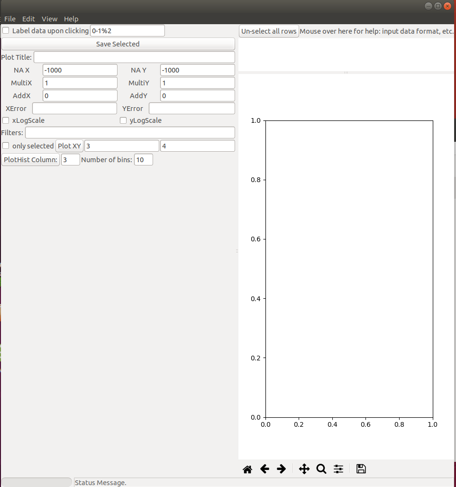
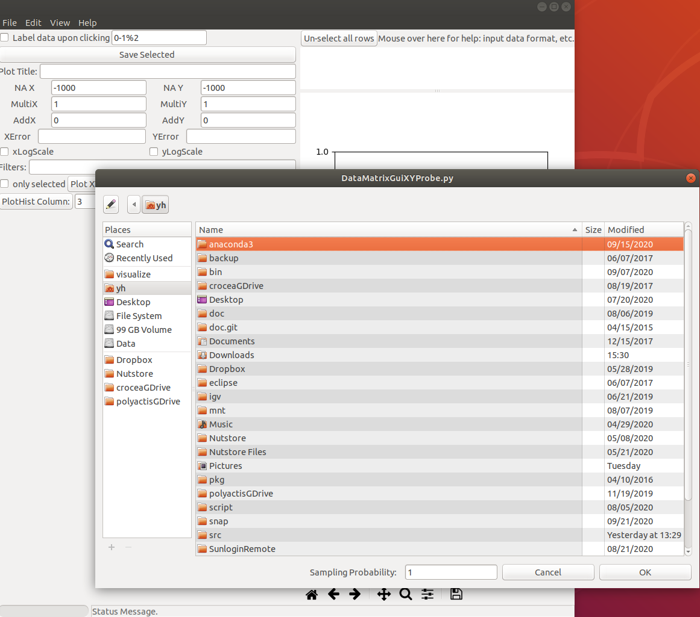
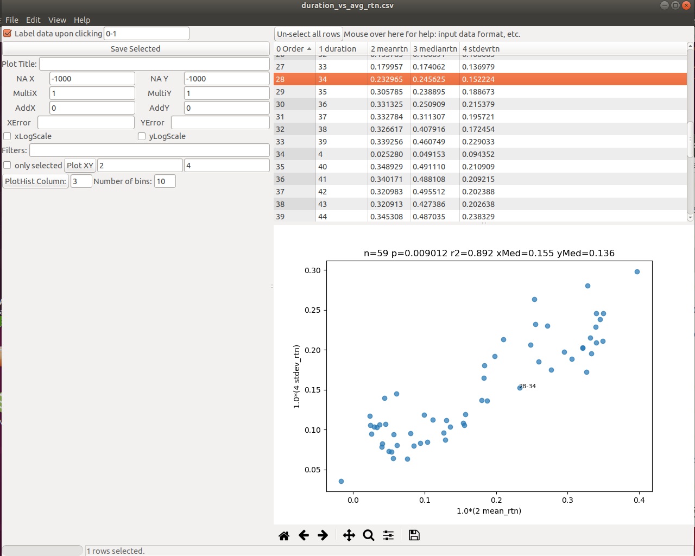

- [1. DataMatrixGUI: A Python2+Gtk2 program.](#1-datamatrixgui-a-python2gtk2-program)
  - [1.1. Prequisites](#11-prequisites)
  - [1.2. How to run](#12-how-to-run)
- [2. Salon: A Python3+Gtk3 upgrade of DataMatrixGUI](#2-salon-a-python3gtk3-upgrade-of-datamatrixgui)
- [3. QCVisualize: A derivative of DataMatrixGUI.py](#3-qcvisualize-a-derivative-of-datamatrixguipy)


This folder contains some GUI programs to inspect data.

# 1. DataMatrixGUI: A Python2+Gtk2 program.

WARNING: Gtk2 is deprecated, replaced by Gtk3. Still runnable on 18.04 but may not in the future.

## 1.1. Prequisites

Install these .deb packages via apt on Ubuntu 16.04/18.04, unless noted.

1. python-glade2
1. python-gnome2
1. python-gtk2
1. python-matplotlib
1. palos (pip install)

On Ubuntu 18.04, install matplotlib manually to make sure matplotlib.backends._backend_gdk is compiled. The Ubuntu matplotlib package did not compile _backend_gdk.so.

* https://stackoverflow.com/questions/14346090/importerror-no-module-named-backend-gdk
* https://bugs.launchpad.net/ubuntu/+source/matplotlib/+bug/1785458
* https://launchpad.net/~jdpipe/+archive/ubuntu/ppa/+packages ("apt install from this PPA" can also obtain a good matplotlib.)

```bash
apt-get install python-gtk2-dev
apt remove python-matplotlib
pip install matplotlib --no-binary=matplotlib
```

## 1.2. How to run

```bash
yh@neon:~/src/pymodule/visualize$ ./DataMatrixGUI.py

```

After starting up, it looks like this:



Open a file by clicking File -> Open (or Ctrl + O)



The plotting looks like this.



Clicking on each dot will output relevant rows (data points) in the console.

Check the "Label data upon clicking" to enable labelling for each clicked dot.

# 2. Salon: A Python3+Gtk3 upgrade of DataMatrixGUI

This is a Python3 version of DataMatrixGUI.py, removing the glade dependency, using Gtk3, no Gnome.

# 3. QCVisualize: A derivative of DataMatrixGUI.py
